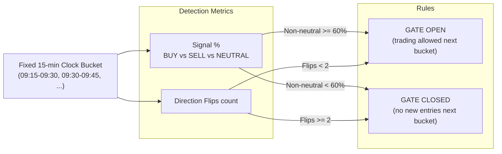

```mermaid
flowchart LR
    Window["Fixed 15-min Clock Bucket<br/>(09:15-09:30, 09:30-09:45, ...)"]

    subgraph DetectionMetrics["Detection Metrics"]
        SignalPct["Signal %<br/>BUY vs SELL vs NEUTRAL"]
        Flips["Direction Flips count"]
    end

    subgraph Rules["Rules"]
        Open["GATE OPEN<br/>(trading allowed next bucket)"]
        Closed["GATE CLOSED<br/>(no new entries next bucket)"]
    end

    Window --> SignalPct
    Window --> Flips

    SignalPct -->|"Non-neutral >= 60%"| Open
    Flips -->|"Flips < 2"| Open
    SignalPct -->|"Non-neutral < 60%"| Closed
    Flips -->|"Flips >= 2"| Closed
```
