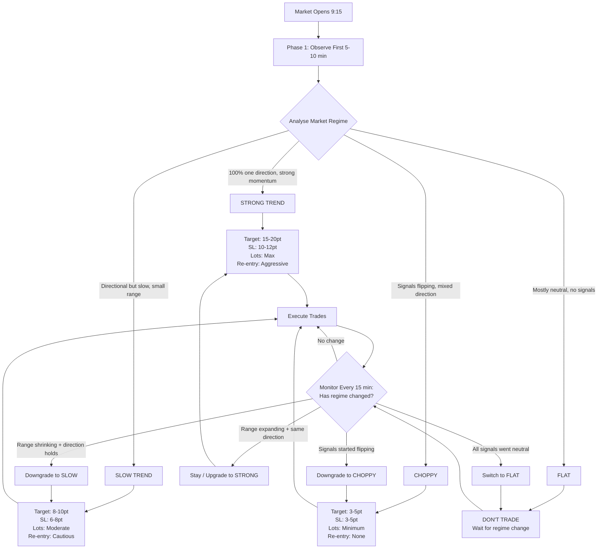

# Market Regime Trading Flow

## Regime Definitions

- **STRONG TREND**
  - Target: 15-20 pt
  - Stop Loss: 10-12 pt
  - Lots: Maximum
  - Re-entry: Aggressive

- **SLOW TREND**
  - Target: 8-10 pt
  - Stop Loss: 6-8 pt
  - Lots: Moderate
  - Re-entry: Cautious

- **CHOPPY**
  - Target: 3-5 pt
  - Stop Loss: 3-5 pt
  - Lots: Minimum
  - Re-entry: None

- **FLAT**
  - Do not trade
  - Wait for regime change