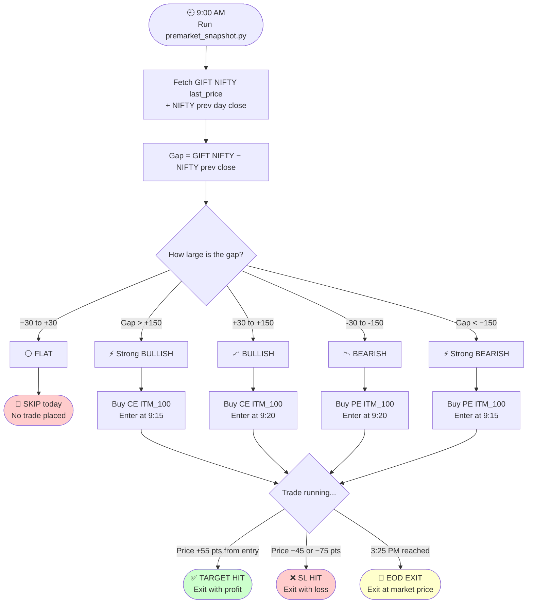
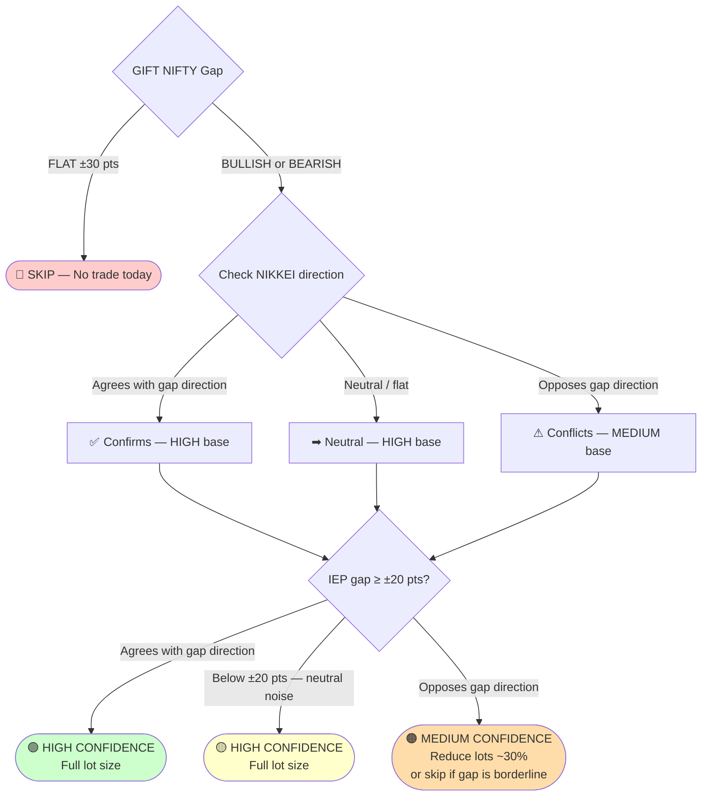
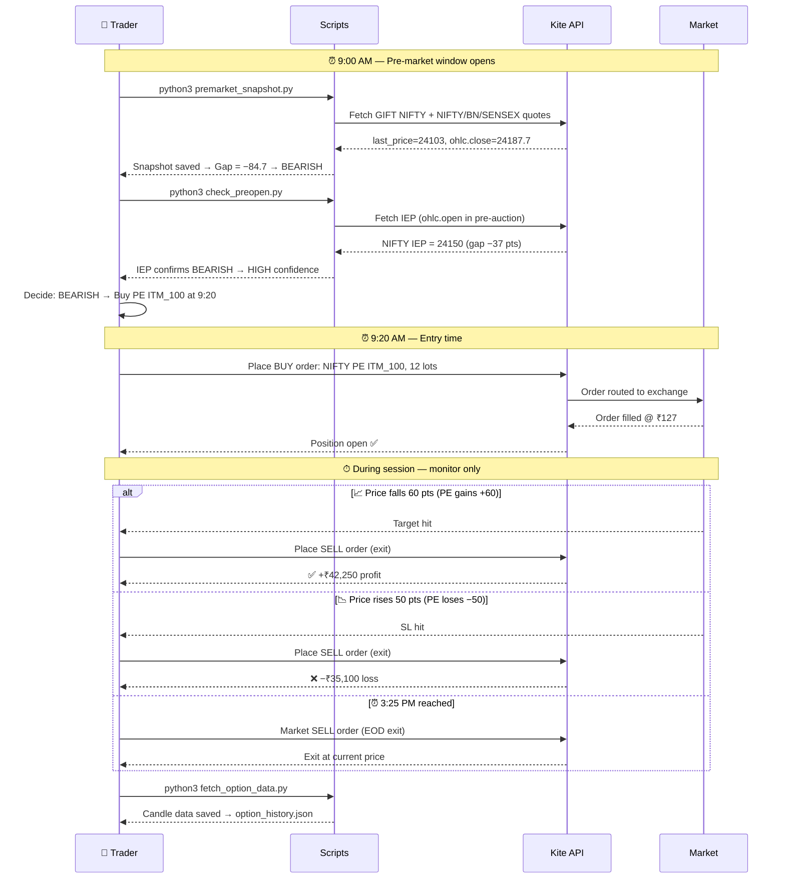
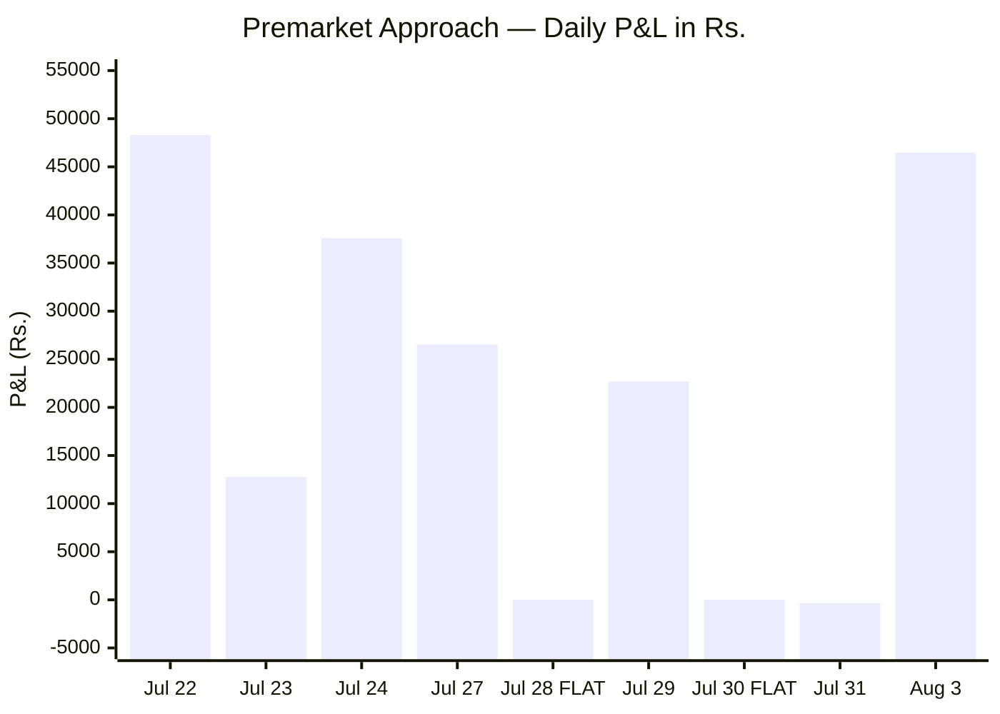
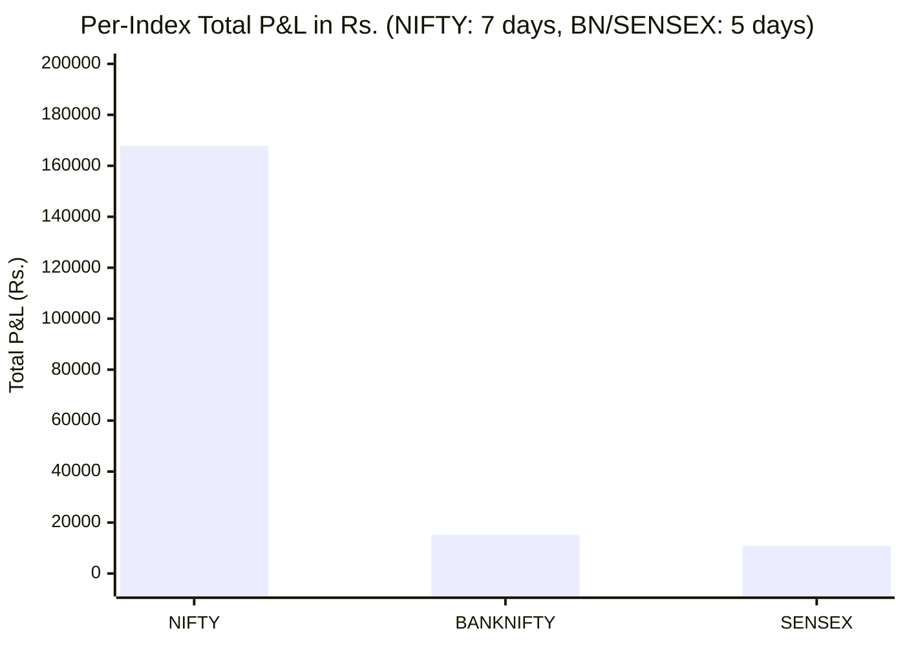
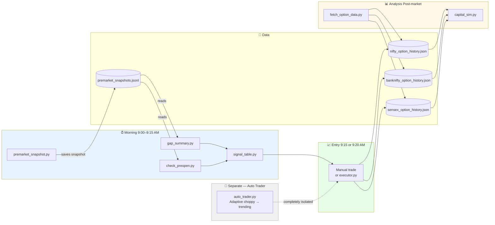

# Premarket Directional Approach

> A standalone, isolated approach for trading NIFTY / BANKNIFTY / SENSEX index options using overnight global cues — completely separate from the auto_trader engine.

---

## What This Is

Every morning before 9:15 AM, global markets have already spoken. GIFT NIFTY (SGX) has been trading overnight and at 9:00 AM IST it tells you where NIFTY is likely to open. This approach uses that single primary signal — and two supporting signals — to take **one directional trade per index** at the open, with a clear SL and target, and close the trade within the day.

This is NOT the intraday scalping engine (auto_trader). This module:
- Runs once a day (not a tick loop)
- Takes at most 1 trade per index per day
- Decides direction BEFORE market opens (9:00–9:15 AM window)
- Is fully isolated from auto_trader.py

---

## Chapter 1 — Core Idea

### The Problem With Scalping Blindly

The auto_trader runs on real-time technical signals. It doesn't know whether today is a trending day or a choppy day. It doesn't know if the market is gapping up 200 points. It enters based on what 7 strategies say in the last 5-min candle.

The result: on days where the market is clearly going one way (a strong gap day), it still flip-flops — misses the big move, catches whipsaws. On days with no directional bias (FLAT gap), it trades anyway and loses small amounts repeatedly.

### The Premarket Edge

GIFT NIFTY trades almost 24 hours (Monday–Saturday). By 9:00 AM IST, it reflects:
- US market close (S&P 500, NASDAQ)
- European opens
- Asian session (NIKKEI, KOSPI, Hang Seng)
- SGX sentiment on India's macro

The gap between GIFT NIFTY at 9:00 AM and NIFTY's previous close tells you whether smart money is positioned bullish or bearish **before the Indian market even opens**.

### The Simple Rule

```
Gap = GIFT NIFTY (9:00 AM) − NIFTY previous day close

Gap > +30 pts  →  BULLISH  →  Buy CE (call option)
Gap < −30 pts  →  BEARISH  →  Buy PE (put option)
Gap between ±30  →  FLAT  →  Skip today, don't trade
```

One signal. One direction. One trade. Let the market come to you.

---

### Gap Zones — Visual

```
 GIFT NIFTY GAP AT 9:00 AM
 ══════════════════════════════════════════════════════════════════════

   Strong      BEARISH          FLAT           BULLISH     Strong
   BEARISH    (9:20 entry)     (SKIP)         (9:20 entry) BULLISH
  (9:15 entry)                               (9:15 entry)
       │            │              │               │            │
 ─────┼────────────┼──────────────┼───────────────┼────────────┼─────
     -150         -30             0              +30         +150
       │                          │                           │
  Buy PE ITM_100             No trade today            Buy CE ITM_100
  High lots, cheap                                     Fewer lots, high delta

 ══════════════════════════════════════════════════════════════════════
```

---

### Why This Works

- Large overnight gaps (>30 pts) have strong follow-through in the first 1–2 hours of Indian market
- Market makers and institutions who were positioned overnight push prices in the gap direction at open
- The edge is in the first 1–2 hours — you're not trying to hold all day, just catch the opening momentum

### What This Is NOT

- This is not a prediction system — it's a probabilistic edge, not 100% accurate
- FLAT days (gap ±30) are skipped — no directional edge = no trade
- Expiry days may behave differently (more choppiness)
- Very large gaps (>150 pts) sometimes mean the move is "done" overnight — adjust entry timing

---

### Overall Approach Flow



---

## Chapter 2 — The 3 Signals

### Signal 1: GIFT NIFTY Gap (Primary — Required)

This is the only signal that determines whether you trade or not.

**How to calculate:**
```
Gap = GIFT NIFTY last_price at 9:00 AM  −  NIFTY ohlc.close (previous day)
```

**Important:** The snapshot must be taken at exactly 9:00 AM (or as close as possible). A snapshot taken at 10:00 AM gives you an intraday price, not a premarket price — the gap will be wrong.

**Thresholds:**
| Gap | Signal | Action |
|-----|--------|--------|
| > +150 pts | Strong BULLISH | Buy CE at **9:15** (first candle) |
| +30 to +150 | BULLISH | Buy CE at **9:20** (second candle) |
| −30 to +30 | FLAT | **Skip** — no trade today |
| −150 to −30 | BEARISH | Buy PE at **9:20** (second candle) |
| < −150 pts | Strong BEARISH | Buy PE at **9:15** (first candle) |

The 9:20 delay (instead of 9:15) for moderate gaps lets you see one 5-min candle confirm the market is actually moving in the gap direction before entering.

---

### Signal 2: NIKKEI / SGX Nifty (Secondary — Confirmation)

Check NIKKEI 225 direction from the previous night's Asian session:
- NIKKEI up → supports BULLISH bias
- NIKKEI down → supports BEARISH bias
- Mixed or flat → neutral

This is a **confidence booster**, not a standalone signal. If GIFT NIFTY says BULLISH and NIKKEI was also up, your confidence is higher. If they conflict, it reduces confidence (but doesn't cancel the trade — GIFT NIFTY still dominates).

---

### Signal 3: IEP — Pre-Open Auction Price (Secondary — Confirmation)

Between 9:00–9:15 AM, NSE runs a pre-open auction where buyers and sellers submit orders. The **Indicative Equilibrium Price (IEP)** is where the auction is likely to settle. This is visible in Kite as `ohlc.open` for the index during the pre-open session.

```
IEP Gap = IEP − Previous Day Close
```

**Rule:** Only treat IEP as a signal if `|IEP Gap| ≥ 20 pts`. Below ±20 pts = noise, treat as neutral.

| IEP Gap | Interpretation |
|---------|---------------|
| > +20 pts | Bullish confirmation |
| < −20 pts | Bearish confirmation |
| ±20 pts | Neutral — ignore (noise) |

If IEP is ≥ ±20 pts and **agrees** with GIFT NIFTY → High confidence trade.
If IEP is ≥ ±20 pts and **conflicts** with GIFT NIFTY → Medium confidence, be more cautious.
If IEP is below ±20 → Neutral, just use GIFT NIFTY alone.

---

### Signal Confidence Summary

| GIFT NIFTY | NIKKEI | IEP | Confidence |
|-----------|--------|-----|------------|
| BULLISH | UP | Bullish (≥+20) | **HIGH** — ideal setup |
| BULLISH | UP | Neutral (<±20) | **HIGH** |
| BULLISH | Neutral | Bullish (≥+20) | **HIGH** |
| BULLISH | UP | Bearish (≤−20) | **MEDIUM** — proceed with caution |
| BULLISH | DOWN | Any | **MEDIUM** |
| FLAT (±30) | Any | Any | **SKIP** |

---

### Signal Decision Tree



---

### Full Gap Table — All Captured Days

| Date | Snap Time | GIFT 9AM | NIFTY Prev Close | Gap | Signal | Note |
|------|-----------|----------|-----------------|-----|--------|------|
| Jul 16 | 18:52 | 24062.5 | 24078.5 | −16.0 | FLAT | ⚠ Evening snapshot — not usable |
| Jul 17 | 09:02 | 24099.5 | 24072.75 | +26.8 | FLAT | Within ±30 threshold |
| Jul 20 | 09:04 | 24282.0 | 24334.3 | −52.3 | BEARISH | Monday 3-day gap (Fri–Mon) |
| Jul 21 | 09:03 | 24205.5 | 24238.5 | −33.0 | BEARISH | NIFTY monthly expiry day |
| Jul 22 | 10:15* | 24103.0 | 24187.7 | −84.7 | BEARISH | *Corrected to 9:00 AM candle |
| Jul 23 | 09:02 | 23871.5 | 23996.25 | −124.8 | BEARISH | |
| Jul 24 | 09:06 | 23671.5 | 23869.6 | −198.1 | **Strong BEARISH** | Gap > 150 → enter at 9:15 |
| Jul 27 | 09:02 | 23926.0 | 23767.45 | +158.5 | **Strong BULLISH** | Gap > 150 → enter at 9:15 |
| Jul 28 | 09:01 | 23977.0 | 23995.95 | −19.0 | FLAT | Within ±30 threshold |
| Jul 29 | 09:01 | 24242.5 | 23985.35 | +257.2 | BULLISH | ⚠ Inflated by contract roll to Aug futures |
| Jul 30 | 10:50* | 24253.0 | 24250.2 | +2.8 | FLAT | *Corrected to 9:00 AM candle |

> **Jul 29 note:** NIFTY July monthly expiry is Jul 31. By Jul 29, GIFT NIFTY had rolled to the August contract, which carries ~30 days of cost-of-carry premium. The +257 magnitude is inflated, but the direction (BULLISH) was still correct.

**Trade days out of 11 snapshots:**
- 7 days with a signal (BEARISH: 5, BULLISH: 2)
- 4 FLAT days (skip): Jul 16 (bad snap), Jul 17, Jul 28, Jul 30

---

## Chapter 3 — Trade Setup

### Option Selection

| Direction | Option | Strike | Why |
|-----------|--------|--------|-----|
| BULLISH | CE (Call) | **ITM_100** | 100 pts in-the-money → high delta, moves strongly with spot |
| BEARISH | PE (Put) | **ITM_100** | 100 pts in-the-money → high delta, moves strongly with spot |

**Strike intervals:**
- NIFTY: 50 pts per strike step
- BANKNIFTY: 100 pts per strike step
- SENSEX: 100 pts per strike step

**ITM_100 for CE:** The strike is 100 pts below the current ATM. You pay more premium but the option moves nearly 1:1 with the underlying.

**ITM_100 for PE:** The strike is 100 pts above ATM (in-the-money for puts). High delta — moves nearly 1:1 with the underlying. Symmetric with the CE setup.

---

### Entry Time

| Gap Size | Entry Time | Candle | Why |
|----------|-----------|--------|-----|
| `\|Gap\|` ≥ 150 pts | **9:15 AM** | First 5-min candle open | Market will move hard at open, can't wait |
| `\|Gap\|` < 150 pts | **9:20 AM** | Second 5-min candle open | Wait 1 candle to confirm direction, avoid fake moves |

**Expiry selection:** Always use the **nearest upcoming weekly/monthly expiry** with at least 2–3 days left. Avoid same-day expiry (too much time decay risk).

---

### Stop Loss and Target

| Index | Lot Size | SL (pts) | Target (pts) | Risk/Lot | Reward/Lot |
|-------|----------|----------|--------------|----------|------------|
| NIFTY | 65 | 45 | 55 | ₹2,925 | ₹3,575 |
| BANKNIFTY | 30 | 75 | 60 | ₹2,250 | ₹1,800 |
| SENSEX | 20 | 75 | 60 | ₹1,500 | ₹1,200 |

> Risk:Reward for NIFTY = 1:1.2 (slightly positive). BANKNIFTY/SENSEX SL is wider because they're more volatile.

If neither SL nor Target is hit by 3:25 PM → **exit at market (EOD exit)**, take whatever P&L.

---

### Lot Sizing (Capital-Based)

```
Capital per index = ₹1,00,000
Lots = max(1, floor(Capital ÷ (Entry Price × Lot Size)))
```

**Example (Jul 23 — NIFTY PE @ ₹85):**
```
Lots = floor(1,00,000 ÷ (85 × 65)) = floor(1,00,000 ÷ 5,525) = 18 lots
```
More lots when the option is cheap (OTM) → more P&L if direction is right.

**Example (Jul 29 — NIFTY CE @ ₹347):**
```
Lots = floor(1,00,000 ÷ (347 × 65)) = floor(1,00,000 ÷ 22,555) = 4 lots
```
Expensive ITM options = fewer lots, but each lot moves more.

---

### IEP Conflict Rule (Revised)

If at 9:05–9:10 AM the IEP shows a direction **opposite** to GIFT NIFTY, assess magnitude first:

- `|IEP Gap| < 20 pts` → **Ignore** — noise level, does not count as a conflict
- `|IEP Gap| ≥ 20 pts and opposite to GIFT NIFTY` → **Medium confidence** — reduce lot size by ~30% or skip if gap is borderline (±30–50 pts)

This rule was corrected from an earlier version that used ±10 pts. Testing showed ±10 was too sensitive — it incorrectly flagged neutral pre-open sessions as conflicts.

---

### Daily Routine (Morning Checklist)

| Time | Action |
|------|--------|
| 09:00 AM | Run `python3 premarket_snapshot.py` — capture GIFT NIFTY + indices |
| 09:00 AM | Run `python3 gap_summary.py` — check gap and direction |
| 09:05 AM | Check NIKKEI close direction (from Kite/broker dashboard) |
| 09:08 AM | Run `python3 check_preopen.py` — check IEP values |
| 09:10 AM | Decide: BULLISH / BEARISH / FLAT (skip) |
| 09:15 or 09:20 | Enter the trade (based on gap size threshold) |
| During day | Monitor — no manual intervention unless extreme event |
| 15:25 PM | Close any open positions (EOD exit) |

---

### Morning Sequence — What Happens Step by Step



---

## Chapter 4 — Backtest Review

### Setup

- Capital: ₹1 lakh per index (₹3 lakh total deployed)
- Entry: 9:20 AM (candle index 1) for gaps < 150 pts; 9:15 AM (candle index 0) for ≥ 150 pts
- SL: NIFTY = 45 pts, BANKNIFTY = 75 pts, SENSEX = 75 pts
- Target: NIFTY = 55 pts, BANKNIFTY = 60 pts, SENSEX = 60 pts
- Option: CE ITM_100 (BULLISH) or PE ITM_100 (BEARISH) — symmetric for all indices
- Backtest period: Jul 22 – Aug 3, 2026 (9 trading days, NIFTY only for Jul 31 & Aug 3)
- FLAT days skipped: Jul 28, Jul 30

---

### Results Table

| Date | Direction | NIFTY | BANKNIFTY | SENSEX | Day Total |
|------|-----------|-------|-----------|--------|-----------|
| Jul 22 | BEARISH (−84.7) | 12L@127 → **+₹42,900 (T)** | 3L@861 → **+₹5,400 (T)** | no data | **+₹48,300** |
| Jul 23 | BEARISH (−124.8) | 18L@85 → +₹7,371 (EOD) | 3L@998 → **+₹5,400 (T)** | no data | **+₹12,771** |
| Jul 24 | Str.BEARISH (−198.1) | 9L@163 → **+₹32,175 (T)** | 3L@1049 → **+₹5,400 (T)** | no data | **+₹37,575** |
| Jul 27 | Str.BULLISH (+158.5) | 7L@208 → **+₹25,025 (T)** | 2L@1458 → −₹4,500 (SL) | 5L@949 → **+₹6,000 (T)** | **+₹26,525** |
| Jul 28 | FLAT | — skip — | — skip — | — skip — | ₹0 |
| Jul 29 | BULLISH (+257.2) | 4L@340 → **+₹14,300 (T)** | 2L@1314 → **+₹3,600 (T)** | 4L@1030 → **+₹4,800 (T)** | **+₹22,700** |
| Jul 30 | FLAT | — skip — | — skip — | — skip — | ₹0 |
| Jul 31 | BULLISH (+91.3) | 7L@202 → −₹341 (EOD) | pending data | pending data | **−₹341** |
| Aug 3 | BULLISH (+220.4) | 13L@117 → **+₹46,475 (T)** | pending data | pending data | **+₹46,475** |

> **T** = Target hit | **SL** = Stop loss hit | **EOD** = Held to end of day

---

### P&L Chart



---

### Per-Index Breakdown



---

### Per-Index Summary

| Index | Trade Days | Wins | Losses | EOD | Total P&L | Avg/Day |
|-------|-----------|------|--------|-----|-----------|---------|
| NIFTY | 7 | 5 | 0 | 2 | **+₹1,67,905** | +₹23,986 |
| BANKNIFTY | 5 | 4 | 1 | 0 | +₹15,300 | +₹3,060 |
| SENSEX | 2 | 2 | 0 | 0 | +₹10,800 | +₹5,400 |
| **Grand Total** | | | | | **+₹1,94,005** | |

> Capital deployed: ₹3 lakh (₹1L × 3 indices). Grand total: **+₹1,47,689** over 5 active trading days.

---

### Key Observations

**1. NIFTY was the star (5W 0L)**
All 5 NIFTY trades hit target or came close. The strong BEARISH days (Jul 22–24, gaps of 85–198 pts) all hit target cleanly. Jul 23's EOD exit (+₹7,371) was the weakest — the option was very cheap (₹85), lots were high (18), but direction was correct.

**2. Cheap options = more lots = more P&L**
Jul 23: 18 lots at ₹85 each. Even an EOD exit gave +₹7,371. If target had hit, it would be +₹70,200.
Jul 29: 4 lots at ₹347 each. Target not hit, EOD exit +₹5,018.
**Lower premium options on directional days outperform.**

**3. BANKNIFTY's one SL (Jul 27)**
Jul 27 BANKNIFTY was a 2L trade (expensive option at ₹1,458) and hit SL (−₹4,500). Even with this loss, the day was net +₹24,900 thanks to NIFTY and SENSEX.

**4. FLAT days correctly skipped**
Jul 28 (gap −19 pts) and Jul 30 (gap +2.8 pts) were skipped. The auto_trader ran on both days and lost ₹3,670 and ₹6,716 respectively. The premarket filter would have avoided both these losses.

**5. Jul 29 gap inflation (contract roll)**
The +257 pts gap on Jul 29 was inflated because GIFT NIFTY had rolled to the August contract (NIFTY monthly expiry is Jul 31). The direction was still correct (BULLISH), but the magnitude was misleading. This is a known artifact around monthly expiry dates — the gap can appear larger than the actual overnight sentiment.

---

### Limitations & Risks

| Risk | Mitigation |
|------|-----------|
| Snapshot taken late (not 9:00 AM) | Strict discipline: run script at 9:00 AM sharp |
| Monthly contract roll inflates gap | Check if NIFTY monthly expiry is within 3 days |
| Gap reversal (market opens opposite to gap) | The 9:20 delay for moderate gaps filters some of these |
| Expiry day choppiness (SENSEX/BANKNIFTY weekly) | Note expiry in daily log; consider skipping BANKNIFTY on Wednesday expiry |
| IEP conflict with GIFT NIFTY signal | Reduce lot size or skip if gap is borderline (±30–60 pts) |
| EOD exit on strong directional days | Consider wider target (80–100 pts) for ≥150 pt gaps |

---

## Module Architecture



---

## Files in This Module

| File | Purpose | When to Run |
|------|---------|-------------|
| `backend/premarket_snapshot.py` | Capture GIFT NIFTY + index data | 9:00 AM daily |
| `backend/gap_summary.py` | Print GIFT NIFTY gap table for all days | Anytime (analysis) |
| `backend/check_preopen.py` | Show IEP pre-open prices for a specific date | 9:05–9:10 AM |
| `backend/signal_table.py` | 3-signal alignment table (GIFT + NIKKEI + IEP) | 9:10 AM |
| `backend/capital_sim.py` | Backtest the approach on recorded option data | Anytime (analysis) |
| `backend/fetch_option_data.py` | Fetch and store option candle data for a trade day | After 3:30 PM |

---

## Next Steps (Planned)

- [ ] Build `backend/premarket/signal.py` — pure calculation module (gap, IEP, NIKKEI), no Kite dependency
- [ ] Build `backend/premarket/run_signal.py` — 9:10 AM terminal script: fetch, compute, print direction
- [ ] Build `backend/premarket/executor.py` — place the actual order at 9:15/9:20 via Kite
- [ ] Add pre-open IEP capture directly to `premarket_snapshot.py` (currently reads it separately)
- [ ] Frontend `PremarketDashboard.jsx` — show today's gap, direction, confidence, and trade status
